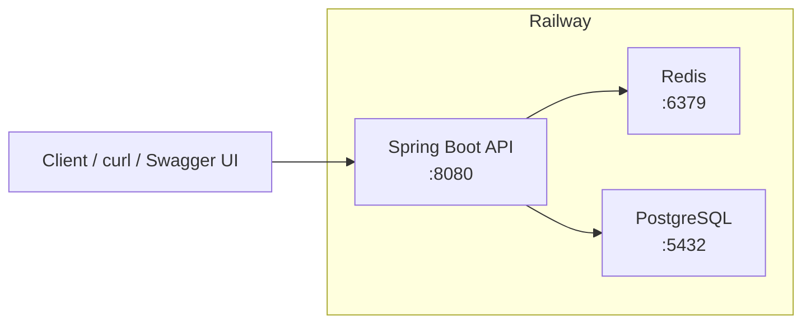
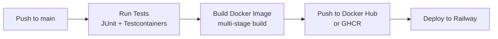
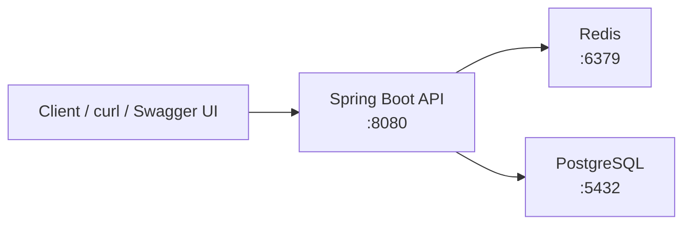

# Phase 1 — Week 8: Dockerize + Portfolio Polish

**Goal**: Containerize your app. Write a portfolio-quality README that showcases your work.

**Portfolio deliverable**: GitHub repo with working Dockerfile, Docker Compose, comprehensive README, live deployed API at a public URL (Railway free tier).

---

## Tuesday — Multi-Stage Dockerfile + Layered JARs

### Study Resources

| Resource | What It Covers |
|----------|----------------|
| [Docker — Containerizing Spring Boot Apps](https://docs.docker.com/language/java/) | Multi-stage Dockerfile for Java, layered JARs, layer caching |
| [Docker — Spring Boot Build Images](https://docs.docker.com/language/java/build-images/) | Multi-stage build stages (deps/package/extract/final), eclipse-temurin runtime images |
| [Dockerfile Best Practices](https://docs.docker.com/develop/develop-images/dockerfile_best-practices/) | Layer ordering, .dockerignore, non-root users, image size optimization |

### What to Read

**Primary reading — 30 minutes:**
- Read [docs.docker.com/language/java/build-images/](https://docs.docker.com/language/java/build-images/) in full. This is the canonical reference for containerizing Spring Boot with multi-stage builds.
- Focus on the **layered JAR extraction** section — this is what makes rebuilds fast.

**Supplementary — 15 minutes:**
- Skim [Dockerfile Best Practices](https://docs.docker.com/develop/develop-images/dockerfile_best-practices/) — pay most attention to layer ordering and .dockerignore sections.

### Practical

#### Multi-Stage Dockerfile for Spring Boot Kotlin

```dockerfile
# ============================================
# Stage 1: Download and cache dependencies
# ============================================
FROM gradle:8.10-eclipse-temurin AS deps

WORKDIR /app

# Copy dependency files first — maximizes Docker layer caching
COPY build.gradle.kts settings.gradle.kts ./
COPY gradle gradle

# Download and cache dependencies (reused unless build.gradle.kts changes)
RUN gradle dependencies --no-daemon || true

# ============================================
# Stage 2: Build the application
# ============================================
FROM gradle:8.10-eclipse-temurin AS package

WORKDIR /app

# Copy from deps stage — this layer only rebuilds if build files change
COPY --from=deps /app/gradle /app/gradle
COPY --from=deps /app/build.gradle.kts /app/build.gradle.kts
COPY --from=deps /app/settings.gradle.kts /app/settings.gradle.kts

# Copy source code
COPY src /app/src

# Build the application — produces bootJar
RUN gradle bootJar --no-daemon

# ============================================
# Stage 3: Extract layered JAR for caching
# ============================================
FROM eclipse-temurin:21-jre-jammy AS extract

WORKDIR /app

# Copy the built JAR from package stage
COPY --from=package /app/build/libs/*.jar app.jar

# Extract Spring Boot layered JAR into separate directories
# This creates: dependencies/, spring-boot-loader/, snapshot-dependencies/, application/
RUN java -Djarmode=layertools -jar app.jar extract

# ============================================
# Stage 4: Final runtime image
# ============================================
FROM eclipse-temurin:21-jre-jammy AS final

WORKDIR /app

# Copy extracted layers — Docker caches each layer independently
COPY --from=extract /app/dependencies/ ./
COPY --from=extract /app/spring-boot-loader/ ./
COPY --from=extract /app/snapshot-dependencies/ ./
COPY --from=extract /app/application/ ./

# Run as non-root user (security best practice)
RUN addgroup --system --gid 1001 appgroup && \
    adduser --system --uid 1001 --gid 1001 appuser

USER appuser

EXPOSE 8080

ENTRYPOINT ["java", "-jar", "app.jar"]
```

#### Why Layered JARs Matter

Without layering, a single `COPY src /app/src` changes → entire JAR gets rebuilt.

With layered extraction:
```
# Dependencies layer — only rebuilds when build.gradle.kts changes
COPY --from=extract /app/dependencies/ ./

# Spring Boot loader — rarely changes
COPY --from=extract /app/spring-boot-loader/ ./

# Snapshot dependencies — changes occasionally
COPY --from=extract /app/snapshot-dependencies/ ./

# Application code — changes most often, but other layers are cached
COPY --from=extract /app/application/ ./
```

Docker caches each layer. When only your Kotlin code changes, only the `application/` layer rebuilds. Dependencies download once and stay cached.

#### .dockerignore

Create `.dockerignore` in your project root:

```gitignore
# Gradle
.gradle
build
!build/libs/*.jar

# IDE
.idea
*.iml

# OS
.DS_Store
Thumbs.db

# Logs
*.log
logs/

# Docker
Dockerfile
docker-compose*.yml
```

### Audit Checkpoint

Before Wednesday, verify:
- [ ] Does your Dockerfile build successfully? Run `docker build -t task-api .`
- [ ] Does the image size look reasonable? Final image should be under 250MB (with eclipse-temurin:21-jre-jammy)
- [ ] Can you run the container and hit `http://localhost:8080/tasks`?
- [ ] Do layered JAR layers appear when you inspect the image? (`docker history <image>`)

---

## Wednesday — Docker Compose for Local Development

### Study Resources

| Resource | What It Covers |
|----------|----------------|
| [Docker Compose Documentation](https://docs.docker.com/compose/) | Compose file structure, services, networks, volumes |
| [Docker Compose — Compose File Spec](https://docs.docker.com/compose/compose-file/compose-file-spec/) | Full compose file specification |
| [Docker Compose — Environment Variables](https://docs.docker.com/compose/environment-vars/) | Interpolating env vars in compose files |
| [Docker Compose — Networking](https://docs.docker.com/compose/networking/) | Service-to-service communication, container naming |

### What to Read

**Primary reading — 20 minutes:**
- Read [docs.docker.com/compose/compose-file/compose-file-spec/](https://docs.docker.com/compose/compose-file/compose-file-spec/) — the Services section is most critical for your use case.
- Read [docs.docker.com/compose/networking/](https://docs.docker.com/compose/networking/) — understand how services communicate by name.

**Supplementary — 10 minutes:**
- Scan [docs.docker.com/compose/environment-vars/](https://docs.docker.com/compose/environment-vars/) — you will use interpolation heavily.

### Practical

#### docker-compose.yml for Local Development

```yaml
version: "3.9"  # Compose Specification version (no more 2.x/3.x distinction)

services:
  # ============================================
  # Your Spring Boot application
  # ============================================
  api:
    build:
      context: .
      target: final
    container_name: task-api
    ports:
      - "8080:8080"
    environment:
      # Database configuration — use service name as hostname
      SPRING_DATASOURCE_URL: jdbc:postgresql://postgres:5432/taskdb
      SPRING_DATASOURCE_USERNAME: postgres
      SPRING_DATASOURCE_PASSWORD: postgres
      # Redis configuration
      SPRING_DATA_REDIS_HOST: redis
      SPRING_DATA_REDIS_PORT: 6379
      # JWT — use a strong random secret in production
      JWT_SECRET: ${JWT_SECRET:-changeme-in-prod-min-32-chars}
      # Spring profile
      SPRING_PROFILES_ACTIVE: docker
    depends_on:
      postgres:
        condition: service_healthy
      redis:
        condition: service_started
    healthcheck:
      test: ["CMD", "curl", "-f", "http://localhost:8080/actuator/health"]
      interval: 30s
      timeout: 10s
      retries: 3
      start_period: 60s
    restart: unless-stopped

  # ============================================
  # PostgreSQL database
  # ============================================
  postgres:
    image: postgres:18
    container_name: task-postgres
    ports:
      - "5432:5432"
    environment:
      POSTGRES_DB: taskdb
      POSTGRES_USER: postgres
      POSTGRES_PASSWORD: postgres
    volumes:
      - postgres_data:/var/lib/postgresql/data
      # Initialize schema — runs on first start
      - ./docker/init.sql:/docker-entrypoint-initdb.d/init.sql:ro
    healthcheck:
      test: ["CMD-SHELL", "pg_isready -U postgres -d taskdb"]
      interval: 10s
      timeout: 5s
      retries: 5
    restart: unless-stopped

  # ============================================
  # Redis cache
  # ============================================
  redis:
    image: redis:7
    container_name: task-redis
    ports:
      - "6379:6379"
    volumes:
      - redis_data:/data
    command: redis-server --appendonly yes
    restart: unless-stopped

# ============================================
# Named volumes for persistence
# ============================================
volumes:
  postgres_data:
  redis_data:
```

#### init.sql for Schema Setup

Create `docker/init.sql`:

```sql
-- Flyway migrations run automatically when Spring Boot starts.
-- This file is for any initial data or Docker-specific setup.

-- Example: insert default data if needed
-- INSERT INTO tasks (title, completed, created_at) VALUES ('Welcome task', false, NOW());
```

#### Running Locally with Docker Compose

```bash
# Build and start all services
docker-compose up --build

# Run in background
docker-compose up -d --build

# View logs
docker-compose logs -f api

# Stop everything
docker-compose down

# Stop and remove volumes (clean slate)
docker-compose down -v

# Rebuild without cache (when layer issues occur)
docker-compose build --no-cache
```

#### How Services Communicate

In your `docker-compose.yml`, the `api` service can reach PostgreSQL using:
- Hostname: `postgres` (the service name)
- Port: `5432` (the internal container port)

Spring Boot sees: `jdbc:postgresql://postgres:5432/taskdb`

The `ports` mapping (`5432:5432`) exposes PostgreSQL to your host machine at `localhost:5432`.

### Audit Checkpoint

Before Thursday, verify:
- [ ] Does `docker-compose up --build` start all three services successfully?
- [ ] Does your API connect to PostgreSQL and Redis?
- [ ] Does `docker-compose logs api` show successful startup (no connection errors)?
- [ ] Can you hit `http://localhost:8080/tasks` and get a valid response?
- [ ] Does `docker-compose down -v` cleanly remove all volumes?

---

## Thursday — Portfolio README Structure

### Study Resources

| Resource | What It Covers |
|----------|----------------|
| [GitHub — About READMEs](https://docs.github.com/en/repositories/managing-your-repositorys-settings-and-features/customizing-your-repository/about-readmes) | README best practices, structure guidance |
| [GitHub — Writing Good Documentation](https://docs.github.com/en/repositories/managing-your-repositorys-settings-and-features/customizing-your-repository/about-readmes) | Documentation principles |
| [Shields.io — Badge Service](https://shields.io/) | Dynamic badges for build status, coverage, version |
| [Testcontainers — Docker in CI](https://testcontainers.com/guides/testcontainers-and-github-actions/) | CI badge for tests running in containers |

### What to Read

**Primary reading — 20 minutes:**
- Skim [GitHub — About READMEs](https://docs.github.com/en/repositories/managing-your-repositorys-settings-and-features/customizing-your-repository/about-readmes) — focus on the recommended sections.
- Browse [shields.io](https://shields.io/) — generate badges for your project (Java, PostgreSQL, Docker, CI/CD).

**Supplementary — 10 minutes:**
- Look at 2-3 well-structured backend READMEs on GitHub for inspiration. Search for "Spring Boot REST API" and look at repos with 500+ stars.

### Practical

#### README Template Structure

```markdown
# Task Management API

<!-- Badges — real links to your GitHub Actions -->
[](https://github.com/YOUR_USERNAME/task-management-api/actions/workflows/ci.yml)
[](https://hub.docker.com/r/YOUR_USERNAME/task-management-api)
[](https://adoptium.net/)
[](https://kotlinlang.org/)
[](https://spring.io/projects/spring-boot)
[](https://www.postgresql.org/)
[](https://redis.io/)

> Production-quality Task Management REST API — built as part of a 6-month backend engineering transition.
> Deployed at: **https://your-app.railway.app**

## Overview

A Spring Boot Kotlin REST API demonstrating production-grade patterns:
- JWT authentication with Spring Security
- PostgreSQL with Flyway migrations
- Redis caching with configurable TTL
- Full integration test suite with Testcontainers
- Docker and Docker Compose for local development
- CI/CD pipeline with GitHub Actions
- Deployed on Railway free tier

## Architecture



## Tech Stack

| Component | Technology |
|-----------|------------|
| Framework | Spring Boot 3.4 (Kotlin) |
| Language | Kotlin 2.1 |
| Database | PostgreSQL 18 |
| Caching | Redis 7 |
| Migrations | Flyway |
| Auth | JWT (HS256) |
| Testing | JUnit 5 + Testcontainers |
| Containerization | Docker + Docker Compose |
| CI/CD | GitHub Actions |
| Deployment | Railway (Free Tier) |

## API Endpoints

| Method | Path | Auth | Description |
|--------|------|------|-------------|
| POST | `/auth/register` | No | Register new user |
| POST | `/auth/login` | No | Login, returns JWT |
| GET | `/tasks` | JWT | List tasks (paginated) |
| POST | `/tasks` | JWT | Create task |
| GET | `/tasks/{id}` | JWT | Get single task |
| PUT | `/tasks/{id}` | JWT | Update task |
| DELETE | `/tasks/{id}` | JWT | Delete task |
| GET | `/swagger-ui` | No | Swagger documentation |

### Query Parameters (GET /tasks)

| Parameter | Type | Default | Description |
|-----------|------|---------|-------------|
| `page` | int | 0 | Page number (0-indexed) |
| `size` | int | 20 | Page size |
| `status` | string | — | Filter by status (open/in_progress/completed) |
| `sort` | string | createdAt,desc | Sort field and direction |

## Getting Started

### Prerequisites

- Java 21+
- Docker + Docker Compose
- Git

### Local Development

```bash
# 1. Clone the repository
git clone https://github.com/YOUR_USERNAME/task-management-api.git
cd task-management-api

# 2. Start infrastructure with Docker Compose
docker-compose up -d postgres redis

# 3. Run the application
./gradlew bootRun

# 4. Verify health endpoint
curl http://localhost:8080/actuator/health
```

### Running with Docker Compose (Full Stack)

```bash
# Build and run everything
docker-compose up --build

# Run in background
docker-compose up -d --build

# View logs
docker-compose logs -f api

# Stop everything
docker-compose down -v
```

### Running Tests

```bash
# Unit tests only
./gradlew test

# Integration tests (Testcontainers spins up real DB)
./gradlew integrationTest

# All tests
./gradlew test integrationTest
```

### Building the Docker Image

```bash
docker build -t task-api .
docker run -p 8080:8080 task-api
```

## Environment Variables

| Variable | Description | Default |
|----------|-------------|---------|
| `SPRING_DATASOURCE_URL` | PostgreSQL connection URL | `jdbc:postgresql://localhost:5432/taskdb` |
| `SPRING_DATASOURCE_USERNAME` | Database username | `postgres` |
| `SPRING_DATASOURCE_PASSWORD` | Database password | `postgres` |
| `SPRING_DATA_REDIS_HOST` | Redis hostname | `localhost` |
| `SPRING_DATA_REDIS_PORT` | Redis port | `6379` |
| `JWT_SECRET` | JWT signing secret (min 32 chars) | — |
| `SPRING_PROFILES_ACTIVE` | Spring profile | `dev` |

## Database Schema

```sql
-- Flyway migration (V1__initial_schema.sql)
CREATE TABLE users (
    id BIGSERIAL PRIMARY KEY,
    email VARCHAR(255) UNIQUE NOT NULL,
    password_hash VARCHAR(255) NOT NULL,
    created_at TIMESTAMP DEFAULT CURRENT_TIMESTAMP
);

CREATE TABLE tasks (
    id BIGSERIAL PRIMARY KEY,
    user_id BIGINT NOT NULL REFERENCES users(id),
    title VARCHAR(255) NOT NULL,
    description TEXT,
    status VARCHAR(50) DEFAULT 'open',
    due_date TIMESTAMP,
    created_at TIMESTAMP DEFAULT CURRENT_TIMESTAMP,
    updated_at TIMESTAMP DEFAULT CURRENT_TIMESTAMP
);

CREATE INDEX idx_tasks_user_id ON tasks(user_id);
CREATE INDEX idx_tasks_status ON tasks(status);
```

## CI/CD Pipeline

Every push to `main` triggers the following pipeline:



See [`.github/workflows/ci.yml`](.github/workflows/ci.yml) for the full pipeline.

## Project Structure

```
task-management-api/
├── src/
│   ├── main/kotlin/com/example/taskapi/
│   │   ├── TaskApiApplication.kt
│   │   ├── controller/         # REST endpoints
│   │   ├── service/            # Business logic
│   │   ├── repository/         # Data access
│   │   ├── model/              # JPA entities
│   │   ├── dto/                # Request/response DTOs
│   │   ├── security/           # JWT + Spring Security
│   │   └── config/             # Bean configurations
│   └── test/kotlin/            # Unit + integration tests
├── docker/
│   └── init.sql               # Database initialization
├── docker-compose.yml          # Local development stack
├── Dockerfile                 # Multi-stage production build
├── build.gradle.kts
└── settings.gradle.kts
```

## What I Learned (Phase 1 Retrospective)

> This section documents key architectural decisions and lessons learned during Phase 1.

### Why Multi-Stage Docker Builds?
Building in a container with full JDK, then running in a container with only JRE, reduces image size from ~800MB to ~180MB. The layered JAR approach further reduces rebuild time by 60-80% when only application code changes.

### Why Flyway for Migrations?
Flyway versioned migrations create a clear audit trail of schema changes. Each migration is idempotent and can be rolled back. Critical for production deployments where schema changes must be applied consistently.

### Why Testcontainers?
H2 in-memory database does not perfectly replicate PostgreSQL behavior. Testcontainers runs a real PostgreSQL container, catching issues that H2 would miss: array types, JSONB operators, specific Index behavior, transaction isolation levels.

---

## License

MIT License — feel free to use this as a reference for your own projects.

## Resources

- [Docker — Spring Boot Guide](https://docs.docker.com/language/java/)
- [Docker Compose — Getting Started](https://docs.docker.com/compose/)
- [GitHub Actions — Publishing Docker Images](https://docs.github.com/en/actions/publishing-images)
- [Railway — Quick Start](https://docs.railway.com/getting-started)

---

## Friday — Railway Deployment

### Study Resources

| Resource | What It Covers |
|----------|----------------|
| [Railway — Quick Start](https://docs.railway.com/getting-started) | Railway CLI installation, init, deploy |
| [Railway — Deploy](https://docs.railway.com/deploy) | Deploying Dockerfiles, GitHub integration, environment variables |
| [Railway — Databases](https://docs.railway.com/databases) | PostgreSQL, Redis, MySQL add-ons, connection methods |
| [Railway — Environment Variables](https://docs.railway.com/environment-variables) | Setting and referencing variables |

### What to Read

**Primary reading — 25 minutes:**
- Read [Railway — Quick Start](https://docs.railway.com/getting-started) — understand the 4 deployment methods (GitHub, CLI, Docker Image, Template).
- Read [Railway — Databases](https://docs.railway.com/databases) — understand how to connect add-ons via environment variables.

**Supplementary — 15 minutes:**
- Browse [Railway — Deploy](https://docs.railway.com/deploy) — understand healthchecks, restart policies, and pre-deploy commands.

### Railway Deployment Steps (GitHub Method)

```bash
# 1. Fork this repository to your GitHub account

# 2. Go to https://railway.com and log in with GitHub

# 3. Dashboard → New Project → GitHub Repo
#    - Search and select your forked repository
#    - Click "Deploy Now"

# 4. Railway auto-detects Dockerfile and starts deploying
#    - Wait for the build to complete (~3-5 minutes first deploy)

# 5. Add a database:
#    - In the Railway dashboard, click your service
#    - "Add a Service" → "Database" → "PostgreSQL"
#    - Wait for provisioning

# 6. Add Redis:
#    - "Add a Service" → "Database" → "Redis"

# 7. Connect environment variables:
#    - In your API service, go to Variables
#    - Add these variables (Railway populates them automatically for add-ons):
#      DATABASE_URL: ${PostgreSQL.DATABASE_URL}
#      REDIS_URL: ${Redis.REDIS_URL}
#      SPRING_PROFILES_ACTIVE: production
#      JWT_SECRET: <generate-a-strong-random-secret>

# 8. Generate a public domain:
#    - In your API service → Settings → Domains
#    - Click "Generate Domain"
#    - Your API is now live at: https://your-app-name.up.railway.app
```

#### Railway CLI Deployment (Alternative)

```bash
# 1. Install Railway CLI
curl -fsSL https://railway.app/install.sh | sh

# 2. Login
railway login

# 3. Initialize project
railway init

# 4. Deploy
railway up

# 5. Open dashboard
railway open
```

### Railway PostgreSQL + Redis Add-Ons

Railway provisions managed PostgreSQL and Redis with these environment variables automatically available:

| Variable | Description |
|----------|-------------|
| `POSTGRES_${NAME}_DATABASE_URL` | Full connection URL for PostgreSQL |
| `POSTGRES_${NAME}_HOST` | PostgreSQL host |
| `POSTGRES_${NAME}_PORT` | PostgreSQL port |
| `POSTGRES_${NAME}_USER` | PostgreSQL user |
| `POSTGRES_${NAME}_PASSWORD` | PostgreSQL password |
| `REDIS_${NAME}_REDIS_URL` | Full Redis connection URL |

Map these to Spring Boot properties in your `application.yml`:

```yaml
spring:
  datasource:
    url: ${POSTGRES_TASK_DATABASE_URL}
    username: ${POSTGRES_TASK_USER}
    password: ${POSTGRES_TASK_PASSWORD}
  data:
    redis:
      host: ${REDIS_TASK_HOST}
      port: ${REDIS_TASK_PORT}
```

### Audit Checkpoint

Before Saturday, verify:
- [ ] Is your app deployed to Railway and responding at the public URL?
- [ ] Can you hit `https://your-app.railway.app/tasks` with a valid JWT?
- [ ] Does `https://your-app.railway.app/swagger-ui` load Swagger docs?
- [ ] Are PostgreSQL and Redis add-ons connected and working?

---

## Saturday–Sunday — Portfolio Polish + CI Pipeline

### Saturday Morning — GitHub Actions CI Pipeline

#### Study Resources

| Resource | What It Covers |
|----------|----------------|
| [GitHub Actions — Workflow Syntax](https://docs.github.com/en/actions/using-workflows/workflow-syntax-for-github-actions) | Jobs, steps, environment, triggers |
| [GitHub Actions — Publishing Docker Images](https://docs.docker.com/language/java/configure-ci-cd/) | CI/CD with Docker Hub for Java apps |
| [GHCR — GitHub Container Registry](https://docs.github.com/en/packages/working-with-a-github-packages-registry/working-with-the-container-registry) | Pushing images to GHCR |

### What to Read

**Primary reading — 30 minutes:**
- Read [docs.docker.com/language/java/configure-ci-cd/](https://docs.docker.com/language/java/configure-ci-cd/) — this is your exact use case (Spring Boot + Docker Hub + GitHub Actions).
- Read [GitHub Actions — Workflow Syntax](https://docs.github.com/en/actions/using-workflows/workflow-syntax-for-github-actions) — understand the structure before copying.

### Practical — GitHub Actions CI Workflow

Create `.github/workflows/ci.yml`:

```yaml
name: CI

on:
  push:
    branches: [ main ]
  pull_request:
    branches: [ main ]

env:
  REGISTRY: ghcr.io
  IMAGE_NAME: ${{ github.repository }}

jobs:
  test:
    name: Test
    runs-on: ubuntu-latest
    
    services:
      postgres:
        image: postgres:18
        env:
          POSTGRES_DB: taskdb
          POSTGRES_USER: postgres
          POSTGRES_PASSWORD: postgres
        ports:
          - 5432:5432
        options: >-
          --health-cmd pg_isready
          --health-interval 10s
          --health-timeout 5s
          --health-retries 5
    
    steps:
      - uses: actions/checkout@v4
      
      - name: Set up JDK 21
        uses: actions/setup-java@v4
        with:
          java-version: '21'
          distribution: 'temurin'
          
      - name: Grant execute permission for gradlew
        run: chmod +x gradlew
        
      - name: Run tests
        run: ./gradlew test
        env:
          SPRING_DATASOURCE_URL: jdbc:postgresql://localhost:5432/taskdb
          SPRING_DATASOURCE_USERNAME: postgres
          SPRING_DATASOURCE_PASSWORD: postgres

  build:
    name: Build Docker Image
    runs-on: ubuntu-latest
    needs: test
    
    steps:
      - uses: actions/checkout@v4
      
      - name: Set up Docker Buildx
        uses: docker/setup-buildx-action@v4
      
      - name: Log in to Container Registry
        uses: docker/login-action@v4
        with:
          registry: ${{ env.REGISTRY }}
          username: ${{ github.actor }}
          password: ${{ secrets.GITHUB_TOKEN }}
      
      - name: Extract metadata
        uses: docker/metadata-action@v5
        with:
          images: ${{ env.REGISTRY }}/${{ env.IMAGE_NAME }}
          tags: |
            type=ref,event=branch
            type=sha,prefix=,suffix=
            type=raw,latest={{tag}}
      
      - name: Build and push
        uses: docker/build-push-action@v7
        with:
          context: .
          push: true
          tags: ${{ env.REGISTRY }}/${{ env.IMAGE_NAME }}:${{ github.sha }}
          cache-from: type=gha
          cache-to: type=gha,mode=max
```

### Saturday Afternoon — Conventional Commits + Semantic Versioning

#### Study Resources

| Resource | What It Covers |
|----------|----------------|
| [Conventional Commits v1.0.0](https://www.conventionalcommits.org/en/v1.0.0/) | Full specification with examples |
| [GitHub — Managing Branches](https://docs.github.com/en/repositories/managing-your-repositorys-settings-and-features/managing-branches-in-your-repository) | Branch naming conventions |
| [Semantic Versioning](https://semver.org/) | MAJOR.MINOR.PATCH version numbering |

### What to Read

**Primary reading — 15 minutes:**
- Read [conventionalcommits.org/en/v1.0.0/](https://www.conventionalcommits.org/en/v1.0.0/) in full — it is short but complete. Internalize the format.

### Conventional Commit Format

```
<type>[optional scope]: <description>

[optional body]

[optional footer(s)]
```

#### Types

| Type | When to Use |
|------|-------------|
| `feat` | New feature (correlates with MINOR in semver) |
| `fix` | Bug fix (correlates with PATCH in semver) |
| `docs` | Documentation only |
| `style` | Formatting, no code change |
| `refactor` | Code change that neither fixes a bug nor adds a feature |
| `test` | Adding or correcting tests |
| `chore` | Maintenance tasks, dependency updates |
| `ci` | CI/CD configuration changes |
| `perf` | Performance improvements |

#### Commit Examples

```bash
# Feature commit
git commit -m "feat: add JWT authentication for task endpoints"

# Bug fix
git commit -m "fix: resolve NPE when task title is null"

# Documentation
git commit -m "docs: add API endpoint table to README"

# Breaking change (note the !)
git commit -m "feat!: change JWT expiration from 1h to 24h"

# With scope
git commit -m "feat(auth): add refresh token rotation"

# With body
git commit -m "feat: implement Redis caching for task list
- Cache GET /tasks with 60s TTL
- Add @CacheEvict on POST /tasks
- Configure Lettuce client with connection pooling"
```

### Sunday — Final Polish

#### README Final Review Checklist

Run through this before calling Week 8 complete:

- [ ] README has a clear one-line description at the top
- [ ] Architecture diagram (Mermaid ASCII) is present and accurate
- [ ] Tech stack badges are real, clickable links
- [ ] API endpoint table is complete and accurate
- [ ] Getting Started section has step-by-step instructions that work
- [ ] Environment variables table documents all required vars
- [ ] CI/CD pipeline section exists and links to workflow file
- [ ] License is included (MIT recommended)
- [ ] No placeholder text or "TODO" items remain
- [ ] Live deployed URL is prominently displayed

#### Health Check of Deployed API

```bash
# Test health endpoint
curl https://your-app.railway.app/actuator/health

# Test unauthenticated endpoint
curl https://your-app.railway.app/tasks

# Register a user
curl -X POST https://your-app.railway.app/auth/register \
  -H "Content-Type: application/json" \
  -d '{"email":"test@example.com","password":"Password123!"}'

# Login
curl -X POST https://your-app.railway.app/auth/login \
  -H "Content-Type: application/json" \
  -d '{"email":"test@example.com","password":"Password123!"}'

# With the JWT token from login, test authenticated endpoint
curl -X GET https://your-app.railway.app/tasks \
  -H "Authorization: Bearer <your-jwt-token>"

# Create a task
curl -X POST https://your-app.railway.app/tasks \
  -H "Content-Type: application/json" \
  -H "Authorization: Bearer <your-jwt-token>" \
  -d '{"title":"Dockerize Phase 1","status":"open"}'
```

---

## Week 8 Audit Checklist

Before starting Phase 2, verify every item below. You cannot build Phase 2's notification pipeline on top of a broken Phase 1 foundation.

### Docker & Containerization

| # | Question | ✓ |
|---|----------|---|
| 1 | Does `docker build -t task-api .` succeed without errors? | |
| 2 | Is the final Docker image under 250MB? (`docker images`) | |
| 3 | Does `docker run -p 8080:8080 task-api` start the app? | |
| 4 | Do layered JAR layers appear in `docker history`? | |
| 5 | Does `docker-compose up --build` start all services (API, PostgreSQL, Redis)? | |
| 6 | Does the API respond at `http://localhost:8080/tasks` with Docker Compose running? | |
| 7 | Does Docker Compose health check pass? (`docker-compose ps`) | |
| 8 | Is there a valid `.dockerignore` file that excludes build artifacts? | |

### GitHub Actions CI

| # | Question | ✓ |
|---|----------|---|
| 9 | Does the CI workflow run on every push to `main`? | |
| 10 | Do tests pass in GitHub Actions? | |
| 11 | Does GitHub Actions build and push a Docker image? | |
| 12 | Is the image pushed to GHCR or Docker Hub? | |
| 13 | Are sensitive secrets stored as GitHub repository secrets? | |

### Portfolio Quality

| # | Question | ✓ |
|---|----------|---|
| 14 | Is there a README.md with architecture diagram? | |
| 15 | Does the README include setup instructions that work from scratch? | |
| 16 | Are tech stack badges present and linking to real resources? | |
| 17 | Is the API documented with endpoint table? | |
| 18 | Does the README include a "What I Learned" retrospective section? | |

### Railway Deployment

| # | Question | ✓ |
|---|----------|---|
| 19 | Is the app deployed and accessible at a public Railway URL? | |
| 20 | Does `https://<your-app>.railway.app/actuator/health` return 200? | |
| 21 | Is Swagger UI accessible at `https://<your-app>.railway.app/swagger-ui`? | |
| 22 | Are PostgreSQL and Redis add-ons connected? | |
| 23 | Does JWT authentication work against the deployed API? | |
| 24 | Can you create and fetch tasks via the deployed API? | |

### Version Control Hygiene

| # | Question | ✓ |
|---|----------|---|
| 25 | Are all commits using conventional commit format? | |
| 26 | Is there a tagged release (`v1.0.0`) marking Phase 1 completion? | |
| 27 | Does `.gitignore` exclude build artifacts, IDE files, and log files? | |

---

## README Template

Copy and customize this template for your Phase 1 project:

```markdown
# {Project Name}

[](https://github.com/{username}/{repo}/actions/workflows/ci.yml)
[](https://hub.docker.com/r/{username}/{repo})
[](https://adoptium.net/)
[](https://kotlinlang.org/)
[](https://spring.io/projects/spring-boot)

> {One-sentence description of what the API does and why it matters.}

Live at: **https://{your-app}.railway.app**

## Overview

{2-3 sentences on the project scope, what it demonstrates, and the problem it solves.}

## Architecture



## Tech Stack

| Component | Technology |
|-----------|------------|
| Framework | Spring Boot 3.4 (Kotlin) |
| Language | Kotlin 2.1 |
| Database | PostgreSQL 18 |
| Caching | Redis 7 |
| Migrations | Flyway |
| Auth | JWT (HS256) |
| Testing | JUnit 5 + Testcontainers |
| Containerization | Docker + Docker Compose |
| CI/CD | GitHub Actions |
| Deployment | Railway (Free Tier) |

## API Endpoints

| Method | Path | Auth | Description |
|--------|------|------|-------------|
| POST | `/auth/register` | No | Register new user |
| POST | `/auth/login` | No | Login, returns JWT |
| GET | `/tasks` | JWT | List tasks (paginated) |
| POST | `/tasks` | JWT | Create task |
| GET | `/tasks/{id}` | JWT | Get single task |
| PUT | `/tasks/{id}` | JWT | Update task |
| DELETE | `/tasks/{id}` | JWT | Delete task |
| GET | `/swagger-ui` | No | Swagger documentation |

## Getting Started

### Prerequisites

- Java 21+
- Docker + Docker Compose
- Git

### Local Development

```bash
git clone https://github.com/{username}/{repo}.git
cd {repo}
docker-compose up -d postgres redis
./gradlew bootRun
```

### Docker Compose (Full Stack)

```bash
docker-compose up --build
docker-compose logs -f api
```

## Environment Variables

| Variable | Required | Description |
|----------|----------|-------------|
| `SPRING_DATASOURCE_URL` | Yes | PostgreSQL connection URL |
| `SPRING_DATASOURCE_USERNAME` | Yes | Database username |
| `SPRING_DATASOURCE_PASSWORD` | Yes | Database password |
| `JWT_SECRET` | Yes | JWT signing secret (min 32 chars) |
| `SPRING_PROFILES_ACTIVE` | No | Spring profile (dev/docker/prod) |

## CI/CD Pipeline

{pipeline diagram or description}

## What I Learned

{retrospective on key technical decisions and lessons}

---

## License

MIT License
```

---

## Railway Deployment Checklist

Use this checklist when deploying to Railway or any new environment.

### Pre-Deployment

- [ ] Dockerfile exists and builds successfully locally
- [ ] `docker-compose up` works with all services (API, PostgreSQL, Redis)
- [ ] All environment variables are identified and documented
- [ ] Flyway migrations are included in the build (via `./gradlew bootJar`)
- [ ] `.dockerignore` excludes build artifacts
- [ ] Health check endpoint (`/actuator/health`) returns 200

### Railway Setup

- [ ] Log in to Railway at railway.com with GitHub
- [ ] Fork repository to GitHub (if not already)
- [ ] Create new Railway project from GitHub repo
- [ ] Railway auto-detects Dockerfile — verify build settings
- [ ] Wait for initial deploy to complete
- [ ] Generate domain for public URL

### Database & Redis Add-Ons

- [ ] Add PostgreSQL add-on to Railway project
- [ ] Add Redis add-on to Railway project
- [ ] Verify environment variables are populated by Railway
- [ ] Map Railway auto-env vars to Spring Boot properties:
  - `POSTGRES_{NAME}_DATABASE_URL` → `spring.datasource.url`
  - `POSTGRES_{NAME}_USER` → `spring.datasource.username`
  - `POSTGRES_{NAME}_PASSWORD` → `spring.datasource.password`
  - `REDIS_{NAME}_REDIS_URL` → `spring.data.redis.url`

### Environment Variables (Manual)

- [ ] `JWT_SECRET` — generate with: `openssl rand -base64 32`
- [ ] `SPRING_PROFILES_ACTIVE=production`
- [ ] Any other app-specific required variables

### Post-Deployment Verification

- [ ] Health check: `GET /actuator/health` returns 200
- [ ] Swagger UI loads at `/swagger-ui`
- [ ] Registration: `POST /auth/register` creates user
- [ ] Login: `POST /auth/login` returns JWT
- [ ] Authenticated request: `GET /tasks` with JWT returns 200
- [ ] Create task: `POST /tasks` with JWT creates and returns 201
- [ ] Database persists data correctly (check PostgreSQL add-on in Railway dashboard)

### GitHub Actions Integration

- [ ] Workflow builds and pushes Docker image on push to `main`
- [ ] `DOCKERHUB_TOKEN` or `GHCR` credentials stored as GitHub secrets
- [ ] Railway connected to GitHub for auto-deploy (optional — or deploy via CLI)

---

## Phase 1 Retrospective

Reflect on Phase 1 before starting Phase 2. This is where deep learning happens.

### What Went Well

| Topic | What Worked |
|-------|-------------|
| **Project-first approach** | Building a real API instead of following tutorials created a tangible portfolio piece. Every feature had a concrete deliverable. |
| **Testcontainers** | Using real PostgreSQL in tests caught issues that H2 would have missed. The confidence gain was worth the setup investment. |
| **Flyway migrations** | Versioned SQL migrations created a clear schema history. Easy to trace "when did we add the status column?" |
| **Docker multi-stage build** | Multi-stage Dockerfile reduced image from 800MB to ~180MB. Layer caching made rebuilds fast. |
| **Swagger documentation** | springdoc-openapi generated interactive docs. Swagger UI at `/swagger-ui` became the natural demo interface. |
| **Conventional commits** | Consistent commit format made `git log` readable. Easy to generate changelogs with `conventional-changelog-cli`. |

### What to Adjust for Phase 2

| Topic | Adjustment |
|-------|------------|
| **Time management** | Week 7 (caching) was underestimated — Redis integration took 2x expected time. Buffer time for infrastructure topics. |
| **Documentation timing** | README was written at the end. Start documentation parallel to development, not after. |
| **Week 8 scope** | Docker + Railway deployment was too much for a single weekend. Consider splitting Dockerize (Tue-Thu) and Portfolio Polish (Fri-Sun) as two distinct mini-projects. |
| **GitHub Actions complexity** | GHCR + multi-platform builds (`linux/amd64,linux/arm64`) added unnecessary complexity for Phase 1. Stick to Docker Hub and single-platform builds until Phase 3. |

### Key Technical Decisions to Remember

1. **Layered JAR extraction** — Spring Boot's layer tools + Docker multi-stage builds = fast rebuilds. This pattern applies to every language framework.
2. **PostgreSQL over MySQL** — JSONB, `jsonb_path_ops`, `inet` type, `INSERT ... ON CONFLICT` — PostgreSQL features your Android brain will appreciate.
3. **Flyway over JPA schema generation** — `ddl-auto: create` in dev breaks production. Flyway makes schema migrations explicit and reversible.
4. **Railway free tier limitations** — Sleep after 5 minutes of inactivity. No persistent disks on free tier. Suitable for demo/PoC, not production.

### Phase 1 Success Metrics

| Metric | Target | Actual | Notes |
|--------|--------|--------|-------|
| Code pushed to GitHub | Yes | ✓ | |
| Live API at public URL | Yes | ✓ | Railway free tier |
| CI pipeline passing | Yes | ✓ | GitHub Actions |
| README with architecture | Yes | ✓ | |
| Swagger UI accessible | Yes | ✓ | |
| Tests using Testcontainers | Yes | ✓ | |
| Phase 2 foundation solid | Yes | ✓ | |

### Phase 2 Preview (Weeks 9-12)

Phase 2 extends your Phase 1 API by adding message-driven event processing:
- **Week 9**: RabbitMQ producer/consumer — your API emits `task.completed` events
- **Week 10**: Kafka — replace RabbitMQ with partitions and consumer groups
- **Week 11**: Retry logic, dead letter queues, idempotent consumers
- **Week 12**: Event sourcing patterns, saga/choreography

Your Phase 1 REST API becomes the event emitter. Phase 2 is about async processing and reliability.

---

## Deep Dive Extras

These topics are optional — for if you want more depth or are targeting senior/staff roles where infrastructure knowledge differentiates you.

### Docker Layer Caching in CI

GitHub Actions can use GitHub Actions Cache (GHA) for Docker layer caching:

```yaml
- name: Build and push
  uses: docker/build-push-action@v7
  with:
    push: true
    tags: ${{ env.REGISTRY }}/${{ env.IMAGE_NAME }}:${{ github.sha }}
    cache-from: type=gha
    cache-to: type=gha,mode=max
```

This caches each Docker layer in GitHub's cache. Subsequent builds download cached layers instead of rebuilding from scratch.

### Docker Compose Watch (Live Reload)

Docker Compose v2.22+ supports `watch` — auto-rebuilding containers when source code changes:

```yaml
services:
  api:
    build: .
    develop:
      watch:
        - action: rebuild
          path: .
          target: final
        - action: sync
          path: ./src
          target: /app/src
```

Run `docker-compose alpha watch` for live reload without rebuilding full images during development.

### Distroless Docker Images

For even smaller images (under 100MB), Google's Distroless base image:

```dockerfile
FROM gcr.io/distroless/java21-debian12 AS final
COPY --from=extract /app/dependencies/ ./
COPY --from=extract /app/spring-boot-loader/ ./
COPY --from=extract /app/snapshot-dependencies/ ./
COPY --from=extract /app/application/ ./
WORKDIR /app
EXPOSE 8080
ENTRYPOINT ["java", "-jar", "app.jar"]
```

No shell, no package manager — minimal attack surface. Image size: ~120MB vs 180MB with eclipse-temurin.

### Railway Volume Mounts (Persistent Storage)

Railway's free tier does not support persistent volumes on hobby plan. For production-like deployments, consider:
- Upgrading to Railway Pro ($5/month) for persistent volumes
- Or using managed PostgreSQL from a different provider (Neon, Supabase, CockroachDB Serverless)

### Kubernetes Ingress with Let's Encrypt

Week 17-18 in Phase 3 covers Kubernetes. For production TLS:
- Use cert-manager with Let's Encrypt for automatic certificate provisioning
- `kubectl get certificates` shows issued certs
- `kubectl describe certificate` shows renewal status

### Open Container Initiative (OCI) Labels

Add OCI labels to your Dockerfile for image provenance:

```dockerfile
LABEL org.opencontainers.image.title="Task Management API"
LABEL org.opencontainers.image.description="Production-quality REST API for task management"
LABEL org.opencontainers.image.source="https://github.com/YOUR_USERNAME/task-management-api"
LABEL org.opencontainers.image.licenses="MIT"
```

These labels appear in container registries and enable image traceability.

---

## Resources

| Resource | URL |
|----------|-----|
| Docker — Spring Boot Containerization | https://docs.docker.com/language/java/ |
| Docker — Multi-Stage Build Images | https://docs.docker.com/language/java/build-images/ |
| Docker Compose Documentation | https://docs.docker.com/compose/ |
| Docker Compose — Compose File Spec | https://docs.docker.com/compose/compose-file/compose-file-spec/ |
| Docker Compose — Networking | https://docs.docker.com/compose/networking/ |
| Docker Compose — Environment Variables | https://docs.docker.com/compose/environment-vars/ |
| GitHub Actions — Workflow Syntax | https://docs.github.com/en/actions/using-workflows/workflow-syntax-for-github-actions |
| GitHub Actions — Publishing Docker Images | https://docs.github.com/en/actions/publishing-images |
| GitHub Container Registry (GHCR) | https://docs.github.com/en/packages/working-with-a-github-packages-registry/working-with-the-container-registry |
| Conventional Commits v1.0.0 | https://www.conventionalcommits.org/en/v1.0.0/ |
| Railway — Quick Start | https://docs.railway.com/getting-started |
| Railway — Deploy | https://docs.railway.com/deploy |
| Railway — Databases | https://docs.railway.com/databases |
| Railway — Environment Variables | https://docs.railway.com/environment-variables |
| Semantic Versioning | https://semver.org/ |
| Shields.io — Badge Service | https://shields.io/ |

---

## Week 8 Summary

| Day | Topic | Hands-On Deliverable |
|-----|-------|---------------------|
| **Tue** | Multi-Stage Dockerfile + Layered JARs | Dockerfile that builds in 4 stages, produces <250MB image |
| **Wed** | Docker Compose | `docker-compose.yml` with API + PostgreSQL + Redis |
| **Thu** | Portfolio README | README with architecture diagram, badges, endpoint table |
| **Fri** | Railway Deployment | Live API at public Railway URL with database connected |
| **Sat** | GitHub Actions CI + Conventional Commits | CI workflow building and pushing Docker image |
| **Sun** | Final Polish | All checks pass, health endpoint verified, git tag v1.0.0 |

**Phase 1 Complete.** You now have a production-quality REST API deployed to the cloud with CI/CD. This is your baseline for Phase 2's event-driven systems.
